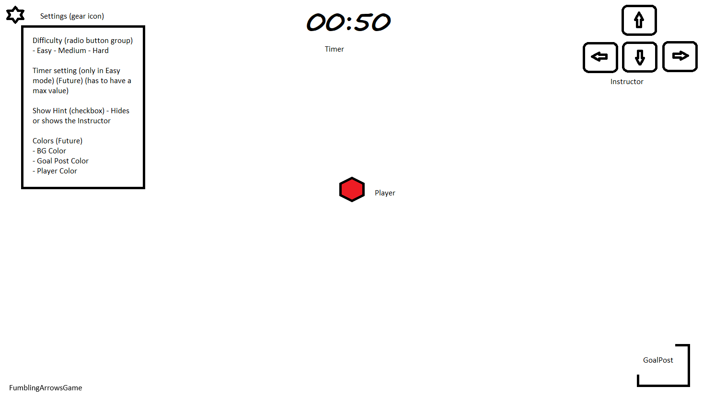

# Fumbling Arrows

A game of arrow keys!

## Game Plan

### Checklist

- [ ] Make the player bounce when idle with shadow
- [ ] Make the player hover with shodow when moving

## References

- [Hooks at a Glance](https://reactjs.org/docs/hooks-overview.html)
- [Replace lifecycle with hooks in React](https://dev.to/trentyang/replace-lifecycle-with-hooks-in-react-3d4n)
- [Handle window resize in React](https://www.hawatel.com/blog/handle-window-resize-in-react/)
- [Conditional Rendering](https://www.robinwieruch.de/conditional-rendering-react/)
- [Refs and the DOM](https://reactjs.org/docs/refs-and-the-dom.html)
- [Run `useEffect` only once](https://stackoverflow.com/questions/53120972/how-to-call-loading-function-with-react-useeffect-only-once)
- [A Complet Guide to `useEffect`](https://overreacted.io/a-complete-guide-to-useeffect/)
- [How to move div with arrows](https://stackoverflow.com/questions/4950575/how-to-move-a-div-with-arrow-keys)